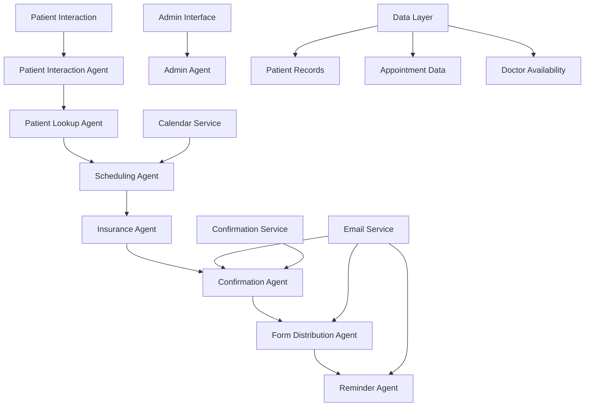
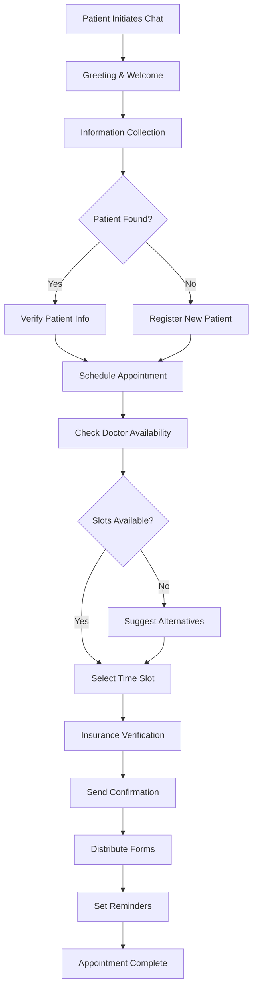

# 🏥 Medical Office Appointment Scheduling Agent

<div align="center">


*AI-powered medical assistant streamlining healthcare appointments*

## 🌐 **Live Application**

**🚀 [Try the Live App Now](https://medicalschedulingagent.streamlit.app)**

Experience the Medical Appointment Scheduling Agent in action! Click the link above to interact with our AI-powered medical assistant and see how it streamlines appointment scheduling and patient management.


[](https://medicalschedulingagent.streamlit.app)

*A sophisticated conversational AI assistant designed to streamline medical office operations through intelligent appointment scheduling and patient management.*

</div>

---

## 📋 Table of Contents

- [🎯 Project Overview](#-project-overview)
- [✨ Key Features](#-key-features)
- [🏗️ System Architecture](#️-system-architecture)
- [🔄 Workflow Process](#-workflow-process)
- [📊 Technology Stack](#-technology-stack)
- [🚀 Quick Start](#-quick-start)
- [📁 Project Structure](#-project-structure)
- [🔧 Configuration](#-configuration)
- [📈 Usage Examples](#-usage-examples)
- [🎨 Screenshots](#-screenshots)

---

## 🎯 Project Overview

The **Medical Office Appointment Scheduling Agent** is an advanced AI-powered chatbot that revolutionizes how medical offices handle patient interactions. Built with cutting-edge conversational AI technology, it provides seamless appointment scheduling, patient information collection, and comprehensive office management capabilities.

### 🎪 What Makes It Special

- **Intelligent Conversation Flow**: Natural, context-aware interactions that feel human-like
- **Multi-Agent Architecture**: Specialized AI agents for different aspects of patient care
- **Edge Case Handling**: Robust management of complex scenarios and exceptions
- **Real-time Integration**: Live calendar synchronization and instant notifications
- **Scalable Design**: Built to handle high-volume medical office operations

---

## ✨ Key Features

### 🤖 **Intelligent Conversation Management**
- **Context-Aware Responses**: Maintains conversation context throughout the entire patient journey
- **Natural Language Processing**: Understands patient intent and responds appropriately
- **Multi-Turn Conversations**: Handles complex, multi-step appointment scheduling

### 👥 **Comprehensive Patient Management**
- **Patient Lookup & Verification**: Instant patient record retrieval and validation
- **New Patient Registration**: Seamless onboarding for first-time patients
- **Information Collection**: Structured data gathering for medical records

### 📅 **Advanced Scheduling System**
- **Real-Time Availability**: Live calendar integration with instant slot checking
- **Doctor-Specific Scheduling**: Assigns appointments based on doctor availability and specialization
- **Alternative Suggestions**: Intelligent recommendations when preferred slots are unavailable

### 🛡️ **Insurance & Verification**
- **Insurance Validation**: Automated insurance information verification
- **Coverage Checking**: Real-time insurance coverage validation
- **Cost Estimation**: Transparent pricing and coverage information

### 📋 **Form Management**
- **Digital Form Distribution**: Automated sending of intake forms
- **Completion Tracking**: Monitors form completion status
- **Escalating Reminders**: Smart reminder system for incomplete forms

### 🔔 **Smart Notification System**
- **Multi-Channel Reminders**: Email and SMS appointment reminders
- **Escalating Alerts**: Progressive reminder intensity for missed appointments
- **Confirmation System**: Automated appointment confirmations

---

## 🏗️ System Architecture



### 🧩 **Multi-Agent Architecture**

| Agent | Responsibility | Key Features |
|-------|---------------|--------------|
| **Patient Interaction** | Initial greeting and conversation flow | Context management, natural language processing |
| **Patient Lookup** | Patient verification and record retrieval | Database queries, new patient handling |
| **Scheduling** | Appointment booking and calendar management | Real-time availability, conflict resolution |
| **Insurance** | Insurance verification and coverage checking | Policy validation, cost estimation |
| **Confirmation** | Appointment confirmation and details | Automated confirmations, change management |
| **Form Distribution** | Digital form sending and tracking | PDF generation, completion monitoring |
| **Reminder** | Appointment reminders and notifications | Multi-channel alerts, escalation logic |
| **Admin** | Administrative functions and reporting | Analytics, system management |

---

## 🔄 Workflow Process

### 📱 **Patient Journey Flow**



### 🎯 **Edge Case Handling**

| Scenario | Solution | Implementation |
|----------|----------|----------------|
| **Patient Not Found** | Automatic new patient registration | Patient lookup agent with fallback logic |
| **Doctor Fully Booked** | Alternative slot/doctor suggestions | Intelligent scheduling with preference matching |
| **Patient Cancellation** | Reason capture and slot freeing | Cancellation tracking with analytics |
| **Form Non-Completion** | Escalating reminder system | Progressive reminder intensity |
| **Insurance Issues** | Manual verification flagging | Exception handling with admin alerts |

---

## 📊 Technology Stack

### 🐍 **Core Technologies**
- **Python 3.8+**: Primary programming language
- **Streamlit**: Web application framework
- **LangChain**: AI/ML framework for conversational AI
- **Pandas**: Data manipulation and analysis

### 🤖 **AI & Machine Learning**
- **OpenAI GPT**: Large language model for natural language processing
- **LangChain Agents**: Specialized AI agents for different tasks
- **Conversation Memory**: Context-aware conversation management

### 📊 **Data Management**
- **CSV Files**: Patient records, appointments, and availability data
- **Pandas DataFrames**: In-memory data processing
- **UUID**: Unique identifier generation

### 🔧 **Development Tools**
- **Python-dotenv**: Environment variable management
- **OpenPyXL**: Excel file processing
- **Typing Extensions**: Enhanced type hints

---

## 🚀 Quick Start

### 📋 **Prerequisites**
- Python 3.8 or higher
- pip package manager
- Git (for cloning the repository)

### ⚡ **Installation Steps**

1. **Clone the Repository**
   ```bash
   git clone <repository-url>
   cd RagAI
   ```

2. **Create Virtual Environment**
   ```bash
   python -m venv venv
   source venv/bin/activate  # On Windows: venv\Scripts\activate
   ```

3. **Install Dependencies**
   ```bash
   pip install -r requirements.txt
   ```

4. **Configure Environment**
   ```bash
   cp .env.example .env
   # Edit .env with your API keys and configuration
   ```

5. **Launch Application**
   ```bash
   streamlit run app.py
   ```

6. **Access the Application**
   - **Live App**: Visit [https://medicalschedulingagent.streamlit.app](https://medicalschedulingagent.streamlit.app) to use the deployed version
   - **Local Development**: Open your browser to `http://localhost:8501` for local development
   - Start interacting with the Medical Appointment Scheduling Agent

---

## 📁 Project Structure

```
RagAI/
├── 🏥 app.py                          # Main Streamlit application
├── 📋 requirements.txt                # Python dependencies
├── 🔧 .env                           # Environment configuration
│
├── 🤖 agents/                        # AI Agent Modules
│   ├── patient_interaction_agent.py  # Initial conversation handling
│   ├── patient_lookup_agent.py       # Patient verification
│   ├── scheduling_agent.py           # Appointment booking
│   ├── insurance_agent.py            # Insurance verification
│   ├── confirmation_agent.py         # Appointment confirmation
│   ├── form_distribution_agent.py    # Form management
│   ├── reminder_agent.py             # Notification system
│   └── admin_agent.py                # Administrative functions
│
├── 🔧 services/                      # Service Modules
│   ├── calendar_service.py           # Calendar integration
│   ├── confirmation_service.py       # Confirmation logic
│   └── email_service.py              # Email notifications
│
├── 📊 data/                          # Data Files
│   ├── patients.csv                  # Patient records
│   ├── doctor_appointments.csv       # Appointment data
│   ├── availability.csv              # Doctor availability
│   └── New Patient Intake Form.pdf   # Digital forms
│
├── 🛠️ utils/                         # Utility Modules
│   ├── data_loader.py                # Data loading utilities
│   └── validators.py                 # Data validation
│
└── 🧪 tests/                         # Test Suite
    ├── test_workflow.py              # Workflow testing
    └── test_final_reminder.py        # Reminder system tests
```

---

## 🔧 Configuration

### 🔑 **Environment Variables**

Create a `.env` file in the project root with the following variables:

```env
# AI Model Configuration
OPENAI_API_KEY=your_openai_api_key_here
GROQ_API_KEY=your_groq_api_key_here

# Email Configuration (Optional)
SMTP_SERVER=smtp.gmail.com
SMTP_PORT=587
EMAIL_USERNAME=your_email@gmail.com
EMAIL_PASSWORD=your_app_password

# Application Settings
APP_TITLE=Medical Appointment Scheduling Agent
APP_ICON=🏥
```

### ⚙️ **Customization Options**

- **Agent Behavior**: Modify agent prompts in individual agent files
- **UI Styling**: Customize Streamlit theme in `app.py`
- **Data Sources**: Update CSV files in the `data/` directory
- **Email Templates**: Customize email content in service modules

---

## 📈 Usage Examples

### 🗣️ **Sample Conversation Flow**

```
👤 Patient: "Hi, I need to schedule an appointment"

🤖 Agent: "Hello! I'm your Medical Appointment Scheduling Agent. 
          How can I assist you today? I'm here to help you book an appointment."

👤 Patient: "I'd like to see Dr. Smith next Tuesday"

🤖 Agent: "I'd be happy to help you schedule an appointment with Dr. Smith. 
          Let me first get some information from you. What's your full name?"

👤 Patient: "John Doe"

🤖 Agent: "Thank you, John. Let me look up your information... 
          I found your record. I see you're due for your annual checkup. 
          Let me check Dr. Smith's availability for next Tuesday..."

[Continues with scheduling, insurance verification, and confirmation]
```

### 📊 **Admin Dashboard Features**

- **Appointment Analytics**: View scheduling patterns and trends
- **Patient Statistics**: Monitor patient engagement and satisfaction
- **System Health**: Monitor agent performance and system status
- **Manual Overrides**: Handle complex cases requiring human intervention

---

## 🎨 Screenshots

### 💬 **Chat Interface**
*Clean, intuitive chat interface with medical office branding*

### 📊 **Admin Dashboard**
*Comprehensive analytics and management tools for office administrators*

### 📱 **Mobile Responsive**
*Fully responsive design that works seamlessly on all devices*

---

## 🎯 **System Requirements**

| Component | Minimum | Recommended |
|-----------|---------|-------------|
| **Python** | 3.8+ | 3.10+ |
| **RAM** | 4GB | 8GB+ |
| **Storage** | 1GB | 5GB+ |
| **Internet** | Required for AI models | Stable connection |

---

<div align="center">

### 🚀 **Ready to Transform Your Medical Office?**

*Experience the future of patient scheduling with our intelligent AI assistant*

**Get Started Today** → `streamlit run app.py`

---

*Built with ❤️ for modern medical practices*

</div>